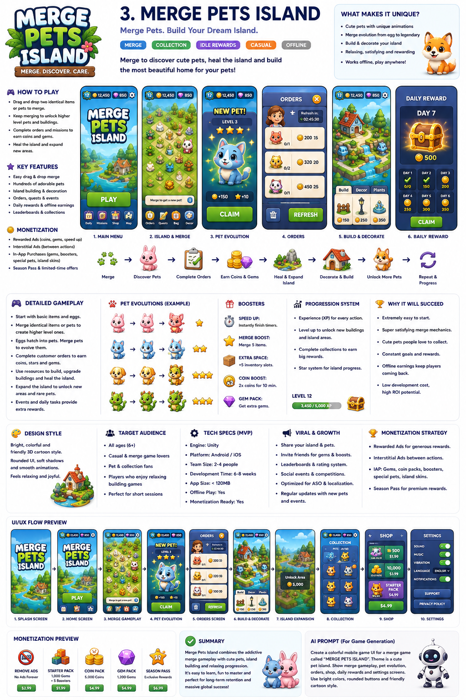

# 🏝️ Merge Pets Island

> **Merge Pets. Build Your Island.** — a relaxing **merge + idle + collection** game.
> Merge cute pets to discover rarer species, let them earn coins passively, and
> expand your island across six biomes. No timers, no lives, anxiety-free.



## ✨ What's inside

A fully playable web build (React + Vite + Zustand) of the game described in the
design brief, plus the Supabase backend definitions and edge functions. The
60-pet catalog was designed by a fleet of 60 agents (one pet each).

| Area | Status |
|------|--------|
| 7×9 merge board, pointer drag-and-drop merge | ✅ |
| Idle coin generation + tap-to-collect + 30-min cap | ✅ |
| Egg shop (Basic / Golden / Mythic) with scaling price | ✅ |
| 60 collectable pets · 8 families · 5 rarities | ✅ |
| Pet Album (Pokédex) | ✅ |
| 6 biomes with level + gem unlock gates | ✅ |
| Daily quests (3/day, easy/medium/hard) | ✅ |
| Daily reward calendar + streak (Day 7 legendary) | ✅ |
| Offline reward (8h cap, ad-double) | ✅ |
| Decorations (+2–4% island boost) | ✅ |
| Shop + IAP catalog (sandbox grants) | ✅ |
| Settings, stats, reduced-motion / color-blind options | ✅ |
| LocalStorage persistence + autosave | ✅ |
| Supabase schema + edge functions (sync, offline, quests, IAP) | ✅ |

## 🚀 Run it

```bash
npm install
npm run dev      # local dev server
npm run build    # type-check + production bundle → dist/
npm run preview  # serve the production build
npm run test     # vitest — engine logic (merge, coin, offline)
```

The web build is fully self-contained — no backend needed to play. Cloud save
and AI quests activate once Supabase env vars are wired (see below).

## 🎮 How to play

1. **Drag** a pet onto another pet of the **same species and level** to merge
   into the next level (more coins/sec).
2. **Tap** a pet to collect the coins it has accumulated (or *Collect All*).
3. Buy **eggs** from the bottom ribbon to discover new pets (rarity-weighted).
4. Complete **daily quests** and claim the **daily reward** for gems.
5. Spend gems on the **Map** to unlock new **biomes** and expand your island.

## 🧱 Architecture

```
src/
├── types.ts              # central type contracts (Entity, Species, SaveState…)
├── data/                 # species (60 pets), families, biomes, eggs, quests, decorations
├── engine/               # mergeRules, coin, spawn, offline (pure logic, unit-tested)
├── store/gameStore.ts    # Zustand store — all game logic & actions
├── components/           # HUD, MergeBoard, PetView, modals, ribbons, panels
├── screens/              # Island, Map, Shop, Album, Settings
├── lib/                  # persistence, rng, format, ads, iap, i18n, analytics
└── styles/global.css     # cute pastel design system
supabase/
├── schema.sql            # tables + RLS + signup trigger
└── functions/            # sync-state, claim-offline, refresh-quests, validate-iap
```

### Key formulas

- **Coin/sec:** `C(n) = floor(2^(n-1) · 0.8 · familyMul · rarityMul)`
- **Basic egg price:** `T(k) = floor(50 · 1.15^k)` (k = eggs bought today)
- **Offline:** `min(8h, elapsed) · Σ pet coin/sec`, doubleable via rewarded ad
- **Accumulation cap:** `coinPerSec · 1800` (30 min) per pet

## ☁️ Backend (optional, for cloud save)

Apply `supabase/schema.sql` to a Supabase project and deploy the edge functions.
Set these env vars on the functions:

- `SUPABASE_URL`, `SUPABASE_ANON_KEY`, `SUPABASE_SERVICE_ROLE_KEY`
- `LOVABLE_API_KEY` (optional — enables AI-personalised daily quests)

## 📦 Mobile (Capacitor)

The app is mobile-first portrait. Wrap with Capacitor for Android/iOS:

```bash
npm i @capacitor/core @capacitor/cli
npx cap init "Merge Pets Island" com.mergepets.island --web-dir dist
npx cap add android && npx cap add ios
npm run build && npx cap sync
```

---

*Merge. Discover. Care.* 🐱🐶🦊🐼🐲🤖🧜🪼
